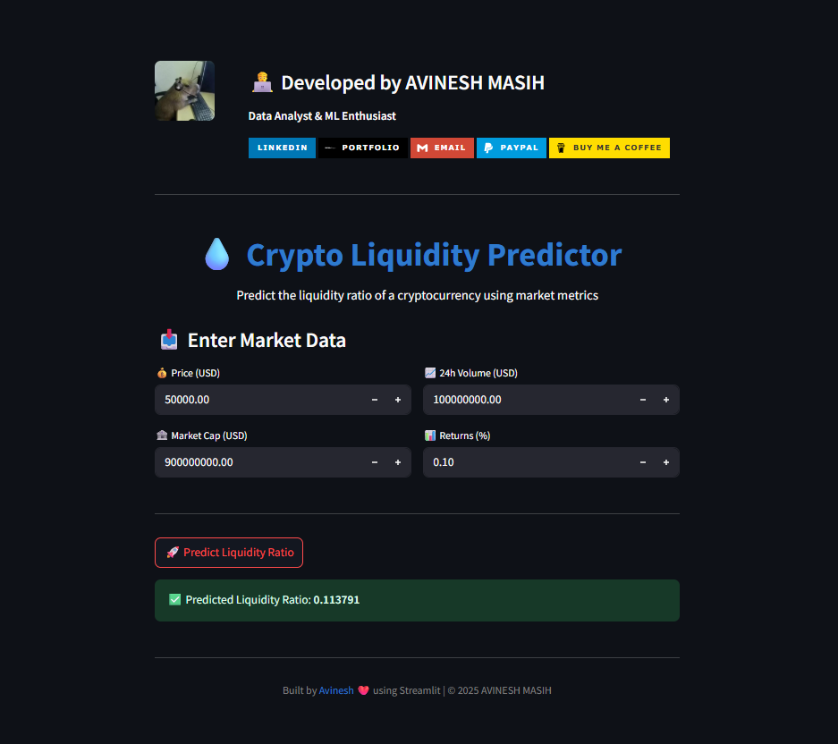
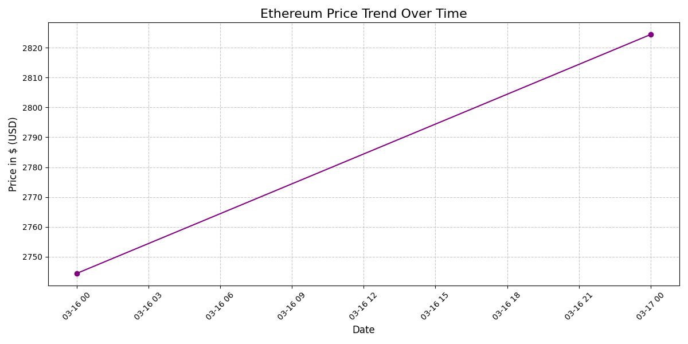

# 🧠 Cryptocurrency Liquidity Prediction for Market Stability

## 📌 Project Type  
**Machine Learning Regression Project**  
A predictive modeling initiative focused on forecasting cryptocurrency liquidity to enhance financial decision-making and promote market stability.

---

## 📂 Project Folder Structure

```
Crypto-Liquidity-Prediction-ML-Project/
│
├── app.py                        # Streamlit web app for live prediction
├── requirements.txt              # Python dependencies
├── README.md                     # Project documentation (this file)
│
├── data/
│   ├── raw/                      # Raw input data (original CSVs)
│   └── processed/                # Cleaned and feature-engineered datasets
│
├── models/                       # Saved/trained ML models (e.g., .pkl files)
│
├── outputs/
│   ├── figures/                  # Plots and visualizations (PNG, etc.)
│   └── models/                   # Output models for deployment/testing
│
├── notebooks/
│   ├── 01_data_exploration.ipynb     # Data loading, cleaning, EDA
│   ├── 02_feature_engineering.ipynb  # Feature creation and transformation
│   └── 03_model_training.ipynb       # Model training, tuning, evaluation
│
└── report/                       # Final project report, documentation, and presentations
```

**Folder Info:**
- `data/raw/`: Contains the original, unprocessed cryptocurrency datasets.
- `data/processed/`: Holds cleaned and feature-engineered CSV files ready for modeling.
- `models/`: Stores trained machine learning models for reuse or deployment.
- `outputs/figures/`: Visualizations and plots generated during EDA and analysis.
- `outputs/models/`: Output models for deployment/testing (may duplicate `models/` for versioning).
- `notebooks/`: Jupyter/VSCode notebooks for each pipeline stage (EDA, feature engineering, modeling).
- `report/`: Final project report, documentation, and presentations.
- `app.py`: Streamlit web application for interactive predictions.
- `requirements.txt`: List of required Python packages.
- `README.md`: Project overview, instructions, and documentation.
---

## Required Python Libraries

Install the necessary Python libraries used in this project by using the `requirements.txt` file:

```
pip install -r requirements.txt
```

---

## 🚀 How to Run the Streamlit App

After installing the required libraries, launch the web application with:

```
streamlit run app.py
```

This will open the Crypto Liquidity Predictor interface in your default web browser.

---

## 📸 Screenshots

Below are some screenshots of the application and outputs:

- **Streamlit Web App Screenshot**
  

- **Ethereum Price Trend  over time Visualization**
  

---

## 🚨 Problem Statement

Cryptocurrency markets are highly volatile, and **liquidity** — the ease of buying or selling an asset without causing significant price changes — plays a vital role in this volatility.

A **liquidity crisis** can cause abrupt price swings, erode market confidence, and increase risks for traders and exchanges.

This project aims to develop a machine learning model that:  
- Predicts liquidity levels using features such as trading volume, transaction patterns, and social sentiment.  
- Provides early warnings of potential liquidity crises.  
- Assists financial platforms and traders in effectively mitigating risk.

---

## 🔄 Machine Learning Lifecycle

The project follows these phases:  
1. Problem Understanding  
2. Data Collection  
3. Data Preprocessing  
4. Exploratory Data Analysis (EDA)  
5. Feature Engineering  
6. Model Selection & Training  
7. Model Evaluation  
8. Hyperparameter Tuning  
9. Model Deployment  
10. Reporting & Documentation  

---

## 🎯 Objective

Build a robust machine learning pipeline to:  
- Predict the **liquidity score or level** of cryptocurrencies.  
- Enable proactive risk management for exchanges, investors, and regulators.  
- Leverage historical crypto data and engineered features (e.g., volatility, moving averages, transaction volume) to train effective predictive models.

---

## 📁 Data Source

The dataset includes public cryptocurrency market data from 2016–2017:  
- Historical price data  
- Trading volumes  
- Timestamped records  

**Download Dataset:**  
[Google Drive Folder](https://drive.google.com/drive/folders/10BRgPip2Zj_56is3DilJCowjfyT6E9AM)

---

## 🧾 Dataset Structure (Columns)

| Column Name  | Description                                   |
|--------------|-----------------------------------------------|
| coin         | Name of the cryptocurrency                     |
| symbol       | Ticker symbol of the cryptocurrency            |
| price        | Current price of the cryptocurrency             |
| 1h           | Price change percentage over the last 1 hour   |
| 24h          | Price change percentage over the last 24 hours |
| 7d           | Price change percentage over the last 7 days   |
| 24h_volume   | Trading volume in the last 24 hours             |
| mkt_cap      | Market capitalization                           |
| date         | Timestamp or date of the record                  |

---

## 📌 Expected Outcomes

- A regression model that predicts cryptocurrency liquidity levels.  
- Visualizations depicting liquidity trends and feature correlations.  
- A locally deployable web app using Streamlit for live prediction testing.  
- Comprehensive documentation covering the entire ML pipeline and architecture.

---

## 📝 Deliverables

- ✅ Cleaned and processed dataset  
- ✅ EDA report (Jupyter notebook or PDF)  
- ✅ Trained ML model (Pickle/Joblib file)  
- ✅ Local deployment of a web interface for prediction  
- ✅ High-level and low-level design documentation  
- ✅ Final project summary report  

---

## 🔐 License

This project is protected under a **custom license**. Unauthorized use, modification, distribution, or reproduction of the code and associated materials is strictly prohibited without explicit written permission from the author.

By accessing this repository, you agree to the following conditions:

- You may view, study, or contribute **only** with prior approval from the repository owner.  
- You may **not** copy, redistribute, or use any part of this repository for personal, academic, or commercial purposes without authorization.

---

## ⚠️ Disclaimer

This code is provided **as-is**, without any warranty — express or implied — including but not limited to warranties of merchantability or fitness for a particular purpose. The author shall not be held liable for any consequences arising from the use or misuse of this repository.

---


---
